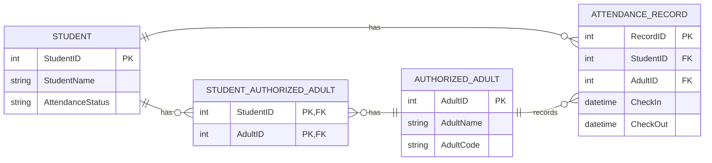

```mermaid
    erDiagram
    direction LR

        STUDENT {
            int StudentID PK
            string StudentName
            string AttendanceStatus
        }

        AUTHORIZED_ADULT {
            int AdultID PK
            string AdultName
            string AdultCode
        }

        ATTENDANCE_RECORD {
            int RecordID PK
            int StudentID FK
            int AdultID FK
            datetime CheckIn
            datetime CheckOut
        }

        STUDENT_AUTHORIZED_ADULT {
            int StudentID PK, FK
            int AdultID PK, FK
        }

        STUDENT ||--o{ STUDENT_AUTHORIZED_ADULT : has
        STUDENT_AUTHORIZED_ADULT }o--|| AUTHORIZED_ADULT : has

        STUDENT ||--o{ ATTENDANCE_RECORD : has
        AUTHORIZED_ADULT ||--o{ ATTENDANCE_RECORD : records
```